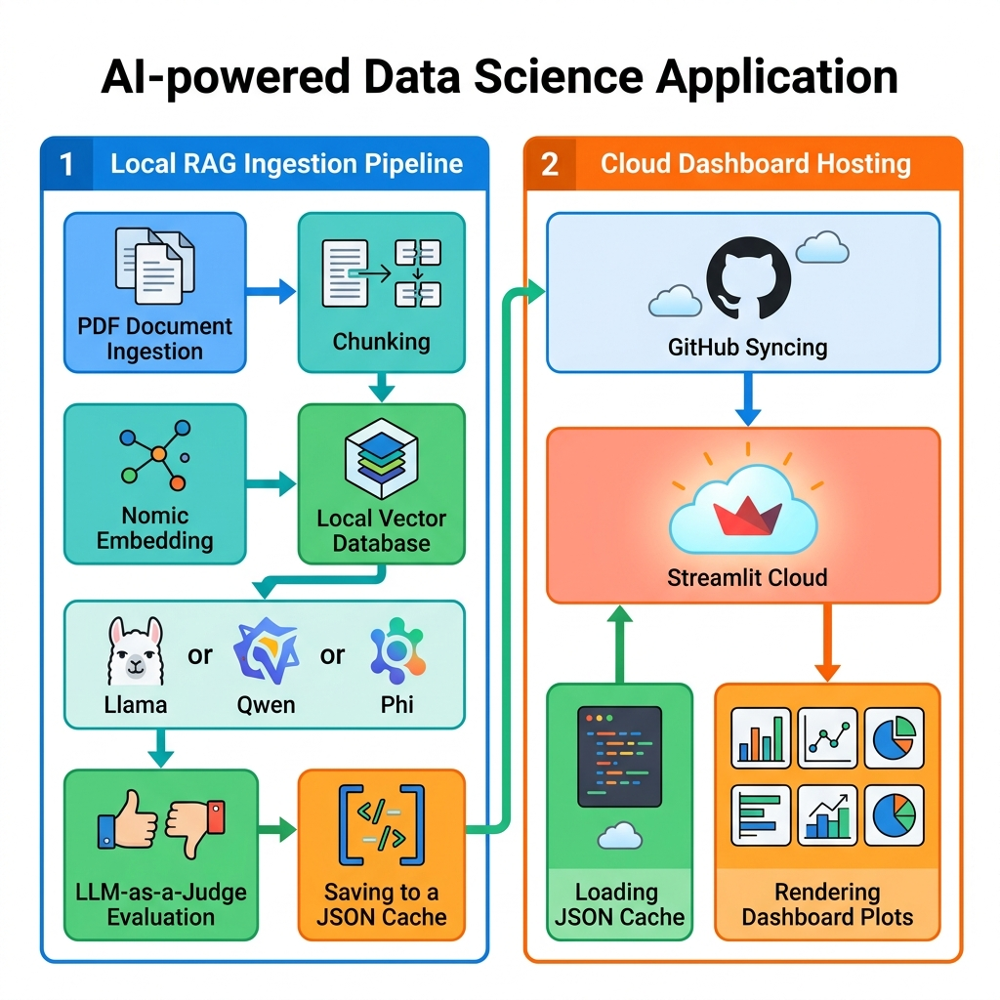
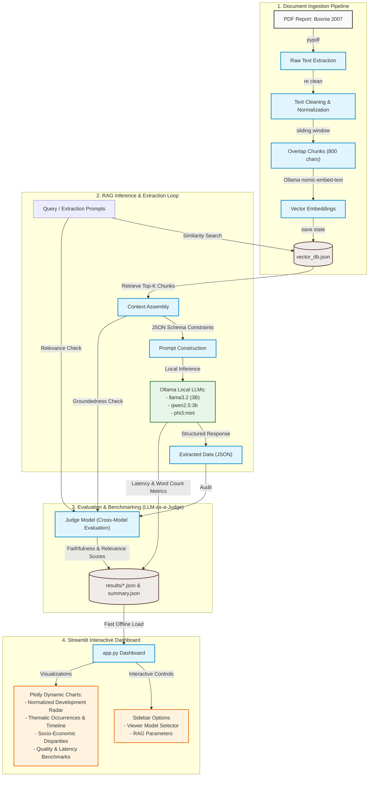

# Bosnia and Herzegovina (2007) NHDR AI Analyzer

A production-grade, local LLM-powered Retrieval-Augmented Generation (RAG) pipeline and interactive analytics dashboard to ingest, process, and analyze the 2007 Bosnia and Herzegovina National Human Development Report (NHDR) on Social Inclusion. Built using modular Python components, local vector stores, and an automated evaluation framework.



## 📐 System Architecture

Below is the conceptual flow of the pipeline, showing how documents are processed, retrieved, analyzed by local LLMs, audited, and rendered in the dashboard:



---

## 🚀 Key Features

- **Modular Software Architecture:** Clean python package design (`src/`) separating PDF processing, vector search, LLM inference, and evaluation logic.
- **Persistent Local Embeddings:** Utilizes `nomic-embed-text` with a custom in-memory vector database that persists index states to disk (`vector_db.json`), avoiding redundant computation.
- **Schema-Constrained Extraction:** Forces models to output strict JSON schemas for core quantitative and qualitative indicators, ensuring high data pipeline reliability.
- **LLM-as-a-Judge Evaluation:** Implements an automated auditor loop that grades generated answers against source text snippets for **Faithfulness** (hallucination checks) and **Relevance**.
- **Multi-Model Benchmarking:** Compares performance metrics (Inference Latency, Word Count, and Evaluation Scores) across three local architectures (`llama3.2`, `qwen2.5:3b`, and `phi3:mini`).
- **Interactive Visual Dashboard:** A polished Streamlit interface (Bosnia and Herzegovina (2007) NHDR AI Analyzer) with dynamic Plotly charts (bar, pie, polar/radar profiles) that loads precomputed caches instantly for easy hosting.
- **Socio-Economic Disparities Tab:** Interactive visualizations showing entity divides, Extreme Social Exclusion Indices (HSEI-1), and group-specific marginalization (such as Roma and displaced persons).
- **Document Narrative Mapping:** Dynamically scans document themes page-by-page using regular expressions and plots thematic timelines to visualize page coordinates where topics are emphasized.
- **Humanized Data Storytelling:** A custom narrative analysis (`storytelling.md`) accompanying each generated plot to provide deep, contextual explanations.

---

## 🛠️ Project Structure

```
ai-un-development-intelligence/
├── src/                        # Backend RAG components
│   ├── __init__.py
│   ├── pdf_processor.py
│   ├── vector_store.py
│   ├── llm_client.py
│   └── evaluator.py
├── results/                    # Cached RAG database & data files
│   ├── vector_db.json          # Persistent vector index
│   ├── summary.json            # Overall benchmarking results
│   ├── llama3_2_results.json   # Model-specific outputs
│   ├── qwen2_5_3b_results.json
│   ├── phi3_mini_results.json
│   └── plots/                  # Generated figures & storytelling
│       ├── theme_frequencies.png
│       ├── theme_frequencies/
│       │   └── storytelling.md
│       ├── theme_timeline.png
│       ├── theme_timeline/
│       │   └── storytelling.md
│       ├── model_benchmark_quality.png
│       ├── model_benchmark_quality/
│       │   └── storytelling.md
│       ├── model_benchmark_efficiency.png
│       ├── model_benchmark_efficiency/
│       │   └── storytelling.md
│       ├── indicator_comparison.png
│       ├── indicator_comparison/
│       │   └── storytelling.md
│       ├── development_radar_profile.png
│       ├── development_radar_profile/
│       │   └── storytelling.md
│       ├── hdi_historical_trend.png
│       ├── hdi_historical_trend/
│       │   └── storytelling.md
│       ├── model_latency_breakdown.png
│       ├── model_latency_breakdown/
│       │   └── storytelling.md
│       ├── qualitative_extraction_depth.png
│       ├── qualitative_extraction_depth/
│       │   └── storytelling.md
│       ├── model_verbosity_comparison.png
│       ├── model_verbosity_comparison/
│       │   └── storytelling.md
│       ├── poverty_rates_by_group.png
│       ├── poverty_rates_by_group/
│       │   └── storytelling.md
│       ├── hsei_social_exclusion.png
│       ├── hsei_social_exclusion/
│       │   └── storytelling.md
│       ├── roma_economic_disparity.png
│       └── roma_economic_disparity/
│           └── storytelling.md
├── app.py                      # Interactive Streamlit dashboard
├── preprocess_country.py       # Pre-processing ingestion runner
├── generate_plots.py           # Static figure generator script
├── run_pipeline.ipynb          # The main Jupyter Notebook submission
├── requirements.txt            # Python library dependencies
├── README.md                   # Setup and execution documentation
└── .gitignore                  # Git exclusions file
```
---

## ⚙️ Setup and Installation

### 1. Prerequisites

- **Ollama:** Download and install from [ollama.com](https://ollama.com).
- **Download Models:** Pull the required local embedding and generator models:
  ```bash
  ollama pull nomic-embed-text
  ollama pull llama3.2
  ollama pull qwen2.5:3b
  ollama pull phi3:mini
  ```

### 2. Python Environment Setup

Clone the repository and install the dependencies:
```bash
pip install -r requirements.txt
```

---

## 📈 How to Run

### 1. Ingestion & Pre-processing (Cache Build)
To process the default country report (`bosniaandhercegovina2007en.pdf`) and cache the multi-model extraction results (saving minutes of live execution time):
```bash
python3 preprocess_country.py
```

### 2. Launch the Streamlit Dashboard
To run the interactive visual dashboard:
```bash
streamlit run app.py
```
*Note: The dashboard is configured to load results directly from the `results/` cache, making it extremely fast, lightweight, and perfect for free cloud hosting (e.g., Streamlit Community Cloud).*

### 3. Generate Static Report Plots (Data Storytelling)
To regenerate the 13 publication-ready static figures (saved under `results/plots/`) comparing model metrics, thematic trends, and socio-economic profiles:
```bash
python3 generate_plots.py
```

### 4. Run the Demonstration Notebook
To step through the RAG code and evaluation logic:
```bash
jupyter notebook run_pipeline.ipynb
```

---

## 💼 Portfolio Highlights (Skills Demonstrated)

- **Local GenAI & LLM Orchestration:** Practical experience running and comparing multiple local LLMs (llama, qwen, phi) offline, optimizing resource-constrained deployment.
- **RAG Architecture Design:** Built document parsing, token-aware overlap chunking, vector indexing, and cosine similarity lookup from scratch.
- **Evaluation & Quality Assurance:** Implemented the *LLM-as-a-Judge* pattern using structured JSON schemas to audit and monitor model hallucinations in data-critical pipelines.
- **Visual Analytics:** Designed interactive data dashboards using Streamlit and Plotly (including polar/radar development profiles, narrative timelines, and socio-economic disparities).
