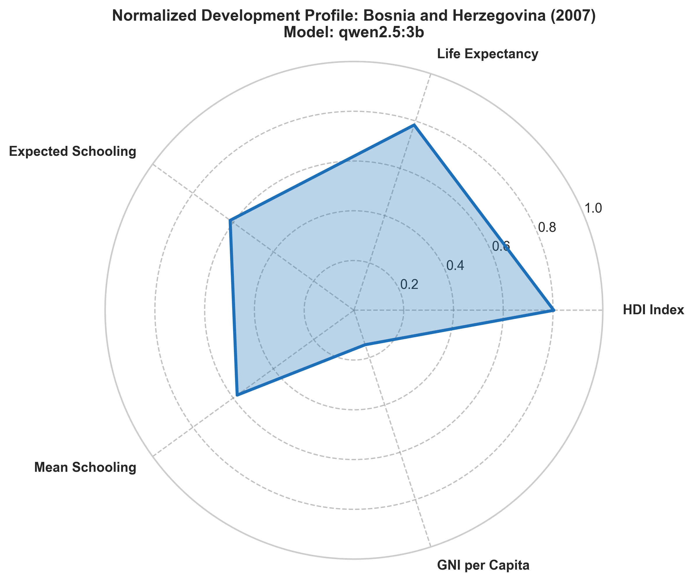

# The Structural Anatomy of Development: Bosnia and Herzegovina's Profile in 2007

A single number like the Human Development Index (HDI) can obscure the complex realities of a country. A country can have high health standards but suffer from a weak economy, or have high average incomes but poor school enrollment. 

This radar chart visualizes the normalized development footprint of Bosnia and Herzegovina (BiH) in 2007, using the data extracted by our best-performing model, **Qwen 2.5:3b**.

## The Story in the Data

* **The Health Strength (Life Expectancy: 74.4 Years)**: The chart shows a strong stretch toward the top-right. BiH's life expectancy was relatively high, reflecting a resilient primary health care system and a generally healthy population base, despite the trauma of the post-conflict transition.
* **The Educational Lag (Expected Schooling: 12.3 Years, Mean Schooling: 8.7 Years)**: These dimensions are normalized against global limits (20 years for expected, 15 years for mean). The profile shows a noticeable contraction here. An average of 8.7 years of education for adults in 2007 points to a historical deficit, exacerbated by the war which disrupted school systems for a decade. The expected schooling of 12.3 years shows improvement for the younger generation, but still lags behind Western European standards.
* **The Economic Chasm (GNI per Capita: $7,280)**: This is the most contracted point on the radar. When GNI per capita is normalized against a global benchmark (capped at $50,000 for visualization), it reveals how low BiH's average incomes were. The country was experiencing economic growth, but the benefits were concentrated, leaving average citizens with low purchasing power.

## Key Takeaway

Bosnia and Herzegovina in 2007 was a classic "medium-high" human development country with a highly uneven profile. It had strong biological survival outcomes (life expectancy), moderate educational progress, but a very weak economic foundation. This mismatch was a primary driver of the social exclusion analyzed throughout the report.
