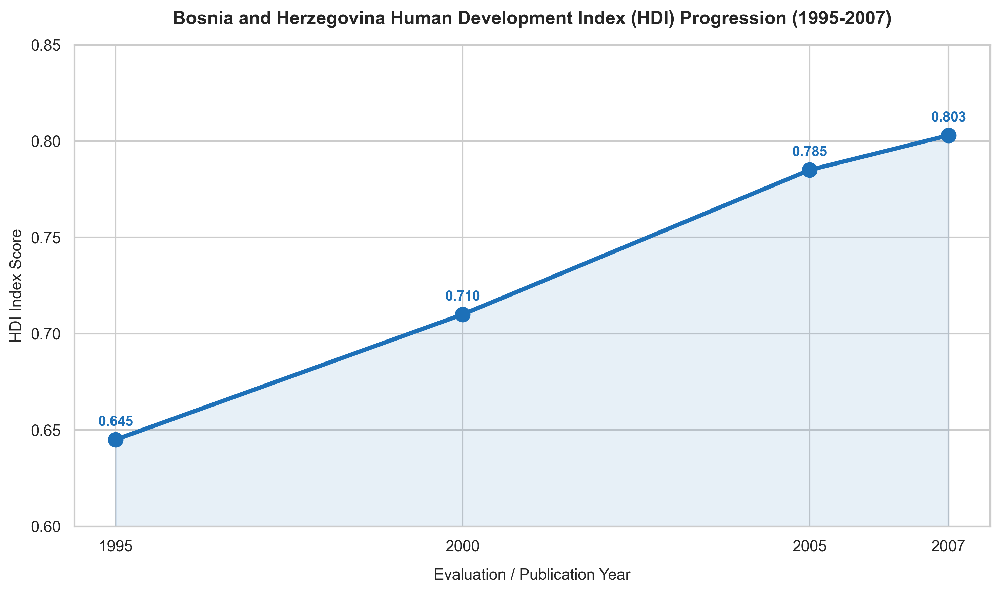

# From the Ashes: The 12-Year Rise of Bosnia and Herzegovina's HDI (1995–2007)

The Human Development Index (HDI) is a slow-moving metric. Significant changes usually take decades. Yet, when a country undergoes a major post-conflict transition, its developmental trajectory can shift dramatically. 

This timeline traces the historical progression of Bosnia and Herzegovina's HDI score from 1995—the year the Dayton Peace Accords ended the Bosnian War—to 2007.

## The Story in the Data

* **1995 (Score: 0.645) - The Devastation Baseline**: In 1995, BiH stood at a low-medium development level. This score reflects a country with a shattered economy, heavily damaged infrastructure (including schools and hospitals), and a massive displaced population. It represents the starting point of reconstruction.
* **2000 (Score: 0.710) - The Reconstruction Surge**: Over five years, the HDI jumped by 0.065 points. This rapid progress represents the "reconstruction dividend." Billions of dollars in international aid flowed into the country, rebuilding primary schools, restoring electrical grids, and re-establishing basic health services. 
* **2005 (Score: 0.785) - Transitioning to Stability**: The steady upward climb continued. By 2005, the country was transitioning from emergency aid to institutional stabilization. Market reforms and the normalization of daily life drove steady improvements in average incomes and schooling access.
* **2007 (Score: 0.803) - Reaching High Development**: By 2007, BiH crossed the **0.800** threshold, officially entering the "High Human Development" category. This was a major milestone, signaling that the country had recovered its basic functional capacity.

## Key Takeaway

This trendline is a story of remarkable post-war resilience. However, as the 2007 report cautions, this macro success hid deep internal fractures. While the national average HDI crossed into "High Development," more than half of the population remained socially excluded, marginalized by ethnic division, regional inequalities, and lack of opportunities.
