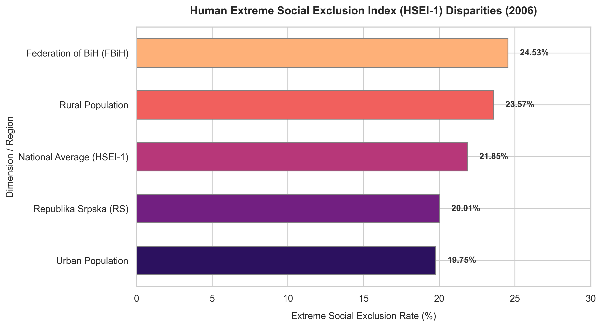

# The Extremes of Exclusion: Analyzing the Human Extreme Social Exclusion Index (HSEI-1)

Traditional developmental analysis focuses on income poverty. However, being "included" in society requires more than just cash in hand. It requires access to healthcare, education, and modern infrastructure. To capture this, the 2007 National Human Development Report introduced the **Human Extreme Social Exclusion Index (HSEI-1)**, measuring exclusion across four proxy dimensions: lack of monetary income, lack of a telephone, lack of health insurance, and adults without a primary education.

This chart compares extreme social exclusion rates across different dimensions and regions of Bosnia and Herzegovina.

## The Story in the Data

* **The National Average (21.85%)**: Nearly 22% of the population—more than one in five citizens—could be categorized as "extremely socially excluded." This is higher than the income poverty rate of 17.8%, proving that social exclusion is a wider and deeper problem than simple income poverty.
* **The Infrastructure Gap (Urban 19.75% vs. Rural 23.57%)**: Rural populations experienced a 19% higher rate of extreme social exclusion than urban dwellers. This points to a severe regional infrastructure deficit. Rural villages frequently lacked basic telephone connectivity, local clinics, and school transport, cutting residents off from national services and networks.
* **The Entity Paradox (RS 20.01% vs. FBiH 24.53%)**: This is the most surprising finding in the report. While Republika Srpska (RS) had a higher rate of income poverty (21% vs 15%), it actually had a *lower* rate of extreme social exclusion (20% vs 24.5%) compared to the Federation of BiH (FBiH). This paradox reveals that FBiH, despite having higher average incomes, suffered from greater disparities in access to public services (like health insurance) and more fragmented infrastructure.

## Key Takeaway

The HSEI-1 index demonstrates that poverty and social exclusion are distinct phenomena. A household can be above the poverty line in terms of income but still remain extremely excluded due to a lack of health insurance or basic communication infrastructure, showing the need for public service reforms.
