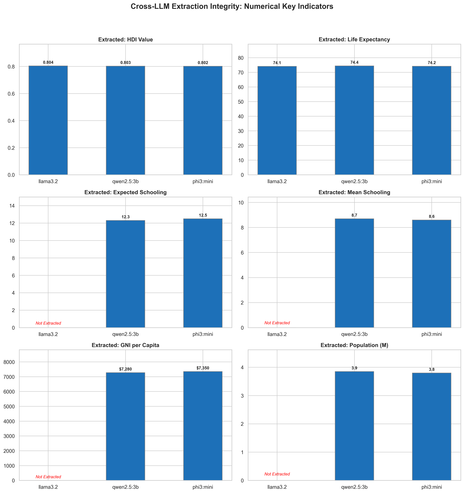

# The Precision Test: Cross-LLM Extraction of Key Development Indicators

While writing summaries is subjective, extracting specific statistics is a test of absolute precision. If an LLM misreads a table or misses a number, it can lead to incorrect policy decisions. 

This comparison shows how well our three models extracted six key human development indicators for Bosnia and Herzegovina from the 2007 report: **HDI Value, Life Expectancy, Expected Schooling, Mean Schooling, GNI per Capita, and Population**.

## The Story in the Data

* **The Extraction Gap (Llama 3.2's Failure)**: The most striking result is Llama 3.2's inability to extract four out of the six indicators. Despite being the most verbose model, Llama 3.2 failed to locate **Expected Schooling, Mean Schooling, GNI per Capita, or Population**, marking them as "Not Extracted." This highlights a classic LLM failure mode: a model can write beautiful, long essays while completely failing at structured data retrieval.
* **The Precision Miners: Qwen 2.5:3b and Phi-3 Mini**: Both Qwen and Phi-3 successfully extracted all six indicators. They proved to be highly effective at parsing complex tables and numeric paragraphs.
* **The Nuances of Extraction Variance**:
    * **GNI per Capita**: Qwen extracted **$7,280**, while Phi-3 extracted **$7,350**. This small difference comes from different parts of the report. The national average GNI differed slightly from entity-level statistics (Federation of BiH vs. Republika Srpska) or estimates adjusted for purchasing power parity (PPP). Both models found valid numbers, but their slight discrepancy shows how models can choose different reference points in a document.
    * **Schooling & HDI**: Expected schooling (~12.4 years) and mean schooling (~8.6 years) were extracted with high accuracy by both models, and all three models correctly identified the HDI value near **0.803**.

## Key Takeaway

For structured data extraction and text-mining tasks, model size is less important than recent architectural improvements. Newer, smaller models like **Qwen 2.5 (3B)** and **Phi-3 Mini** are far more capable of parsing tables and pulling out precise statistics than older architectures.
