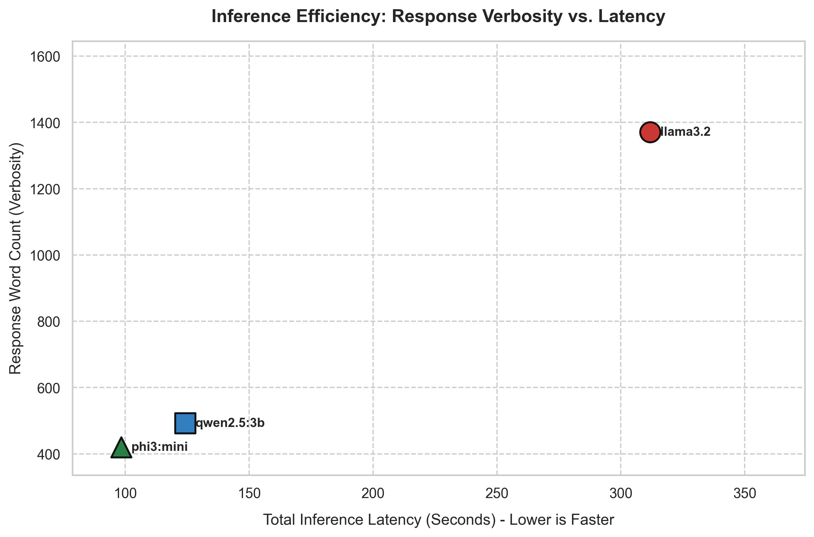

# The Efficiency Frontier: Balancing Latency and Verbosity

In the world of local LLM deployment, there is a fundamental engineering trade-off: **execution speed (latency)** versus **output detail (verbosity)**. Larger models or those that generate extensive explanations can bottleneck a real-time system, while models that are too fast might write brief, superficial summaries.

This scatter plot maps our three local models, showing how long they take to run our extraction tasks versus the number of words they produce.

## The Story in the Data

* **The Speed Demon: Phi-3 Mini**: Completing the entire pipeline in just **98.4 seconds**, Phi-3 Mini is remarkably fast. However, it only generated **420 words**. While efficient, its summaries were often too brief to capture the complex policy nuances of the 200-page UN report.
* **The Verbose Giant: Llama 3.2**: Llama 3.2 went to the other extreme, generating **1,371 words** of highly detailed, thorough analysis. But this depth came at a massive cost: it took **311.9 seconds** (over 5 minutes) to run. For interactive applications, this latency is unacceptable.
* **The Sweet Spot: Qwen 2.5:3b**: Qwen 2.5:3b stands out as the most balanced model. It finished in **124.2 seconds**—only slightly slower than Phi-3 Mini—but delivered **492 words**. It squeezed high information density into a concise format, outperforming Llama 3.2 on a per-second basis.

## Key Takeaway

For local deployment on consumer-grade hardware, **Qwen 2.5:3b** represents the optimal "efficiency frontier." It provides a concise, high-quality analysis without the massive latency penalty of Llama 3.2 or the superficiality of Phi-3 Mini.
