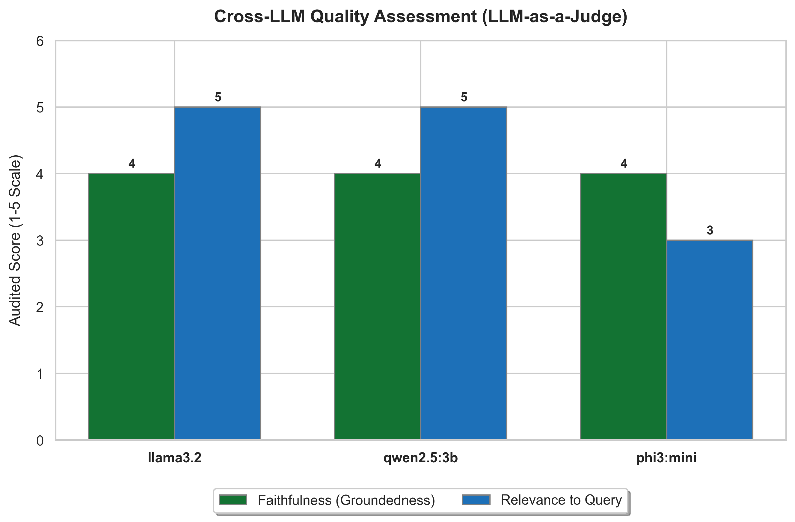

# Evaluating the Judges: Faithfulness vs. Relevance in LLM Extractions

When using artificial intelligence to parse dense, high-stakes policy documents like UN Human Development Reports, accuracy is non-negotiable. If a model hallucinates facts or drifts off-topic, it becomes a liability rather than an asset. 

This benchmark compares how three local LLMs—**Llama 3.2**, **Qwen 2.5:3b**, and **Phi-3 Mini**—performed when evaluated by an automated "LLM-as-a-Judge" auditor on a scale of 1 to 5.

## The Story in the Data

* **Faithfulness (Groundedness) is Uniformly High (Score: 4/5)**: All three models achieved a score of 4 out of 5 for faithfulness. This is highly reassuring. It indicates that the RAG (Retrieval-Augmented Generation) pipeline succeeded in keeping the models grounded. None of the models hallucinated wild statistics or fabricated policies; their summaries were strictly backed by the text blocks provided to them. The missing point (preventing a perfect 5/5) is due to minor omissions of subtle context or terminology (e.g., missing specific historical terms).
* **The Relevance Divide**: The real separation between the models occurred in the relevance score, which measures how directly and completely the model answered the user's specific questions.
    * **Llama 3.2 & Qwen 2.5:3b (Score: 5/5)**: Both models were exemplary. They addressed every aspect of the prompt, separating key findings, developmental achievements, and policy goals cleanly.
    * **Phi-3 Mini (Score: 3/5)**: Phi-3 Mini struggled to maintain focus. The auditor noted that its output lacked depth and specificity. More importantly, it brought in external context—such as general frameworks for EU integration—that were not present in the verified context blocks. This tendency to drift off-topic dragged its relevance score down.

## Key Takeaway

For RAG applications where precision and adherence to instructions are critical, newer architectures like **Qwen 2.5 (3B)** and **Llama 3.2** show superior instruction-following capabilities. **Phi-3 Mini** is functional but requires tighter prompt constraints to prevent it from wandering.
