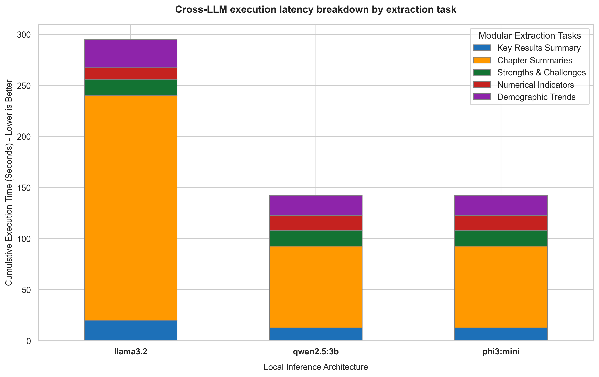

# Demystifying the Clock: Where RAG Pipelines Spend Their Time

When designing a Retrieval-Augmented Generation (RAG) system for document analysis, latency is a critical user experience factor. Users want fast responses, but a complex analysis requires multiple steps. 

This stacked bar chart breaks down the execution latency of our three local models across five specific sub-tasks: **Key Results Summary, Chapter Summaries, Strengths & Challenges, Numerical Indicators, and Demographic Trends**.

## The Story in the Data

* **The Chapter Summary Bottleneck**: For all three models, **Chapter Summaries** is the overwhelming bottleneck, consuming the vast majority of the execution time. Why? Because this task is a high-token, iterative process. The pipeline must query the vector store and run the LLM ten times in sequence—once for each of the ten chapters in the report. This sequential loop multiplies the model's base latency, showing that RAG performance is heavily dependent on task structure.
* **Lightweight Extraction Tasks**: Tasks like extracting **Numerical Indicators** or **Demographic Trends** are relatively quick, taking only a few seconds. These tasks involve concise queries and structured outputs (extracting a few numbers), requiring very few input and output tokens.
* **The Model Disparity**: Llama 3.2's latency is massive compared to Qwen 2.5:3b and Phi-3 Mini. While Qwen and Phi-3 complete the entire suite of tasks in under two minutes, Llama 3.2 takes over five minutes. This shows that model size and inference efficiency scale differently depending on the complexity of the task.

## Key Takeaway

If you want to speed up a document analysis pipeline, focus on the **Chapter Summaries** step. Introducing parallel processing (running chapter extractions concurrently) or using a faster, smaller model specifically for the summarization loop will yield the biggest latency improvements.
