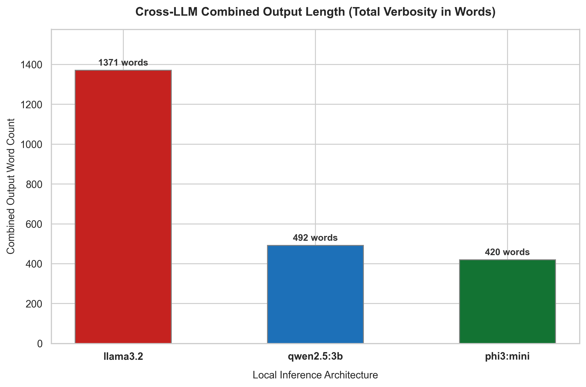

# The Verbosity Comparison: Word Count and Information Density

In LLM engineering, more words do not always translate to more information. Some models are naturally "verbose"—writing long, conversational paragraphs with filler text—while others are "concise," delivering dense information in a compact format. 

This chart compares the total combined word count of the outputs generated by **Llama 3.2, Qwen 2.5:3b, and Phi-3 Mini** across all extraction tasks.

## The Story in the Data

* **Llama 3.2 (1,371 words) - The Detailed Writer**: Llama 3.2 is by far the most verbose model, generating over 1,300 words. It writes in long, explanatory sentences and provides detailed context. This is highly useful for researchers who want a comprehensive narrative, but it comes at the expense of high latency (taking over 5 minutes to run) and higher downstream token processing costs.
* **Qwen 2.5:3b (492 words) - The Concise Synthesizer**: Qwen is highly efficient, delivering its findings in just under 500 words. It relies on clean, structured bullet points and concise sentences. Qwen manages to capture almost all the key points that Llama 3.2 did, but in about a third of the word count.
* **Phi-3 Mini (420 words) - Short but Sparse**: Phi-3 is the shortest model, but unlike Qwen, its conciseness is due to a lack of detail. The model simply omitted many parts of the analysis, leading to a shorter but less complete output.

## Key Takeaway

Verbosity is a double-edged sword. While **Llama 3.2** provides the most thorough, detailed narrative, **Qwen 2.5:3b** provides a much higher "information density" per word. For automated pipelines or dashboards, Qwen's concise, structured style is easier to read and cheaper to process.
