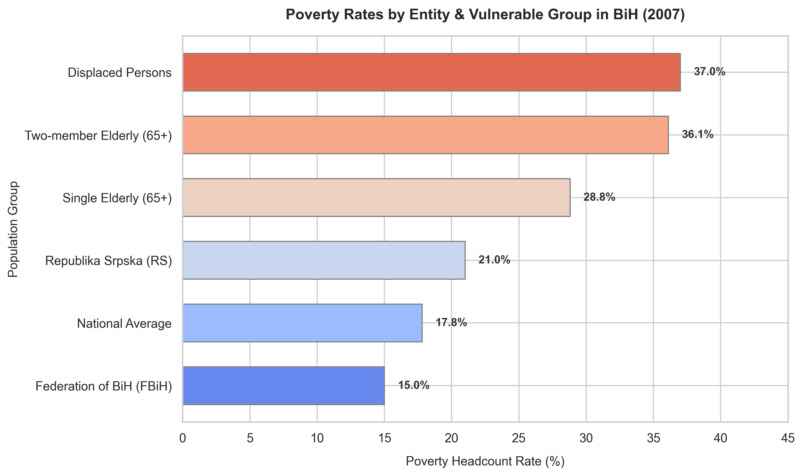

# The Geography of Poverty: Mapping Disparities across Entities and Vulnerable Groups

In Bosnia and Herzegovina, poverty was not a uniform experience in 2007. It had clear geographical boundaries and group-specific characteristics. While the country's national average poverty headcount rate stood at 17.8%, this number hid deep internal divides.

This chart visualizes poverty rates across administrative entities and specific vulnerable groups, showing the uneven nature of the post-conflict transition.

## The Story in the Data

* **The Entity Divide (FBiH 15% vs. RS 21%)**: There was a clear economic gap between the two main entities. The poverty rate in Republika Srpska (RS) was 40% higher than in the Federation of Bosnia and Herzegovina (FBiH). This disparity was a legacy of the war's differing physical destruction, unequal distribution of industrial bases, and the concentration of returns in specific war-torn areas.
* **The Elderly Vulnerability (Single 28.8%, Two-Member 36.1%)**: The elderly were among the hardest hit by material poverty. For single-member elderly households, nearly 29% lived below the poverty line. For two-member elderly households (usually an elderly couple with no dependent or working children in the house), the rate jumped to over 36%. In a country where the pension system was fragmented and average pension payments were extremely low, growing old without active support from relatives meant falling into deep poverty.
* **Displaced Persons (37%)**: Displaced persons faced the highest poverty rate of all surveyed groups at 37%—more than double the national average. Having fled their pre-war homes, they lost not only their material assets but also their local family and community networks. In BiH's relationship-based economy, losing these networks made finding formal employment nearly impossible, forcing them into long-term exclusion.

## Key Takeaway

Macroeconomic growth in 2007 was failing to trickle down to the most marginalized segments of society. The data demonstrates that poverty in BiH was highly concentrated among displaced populations and elderly households, requiring targeted social assistance rather than broad economic policies.
