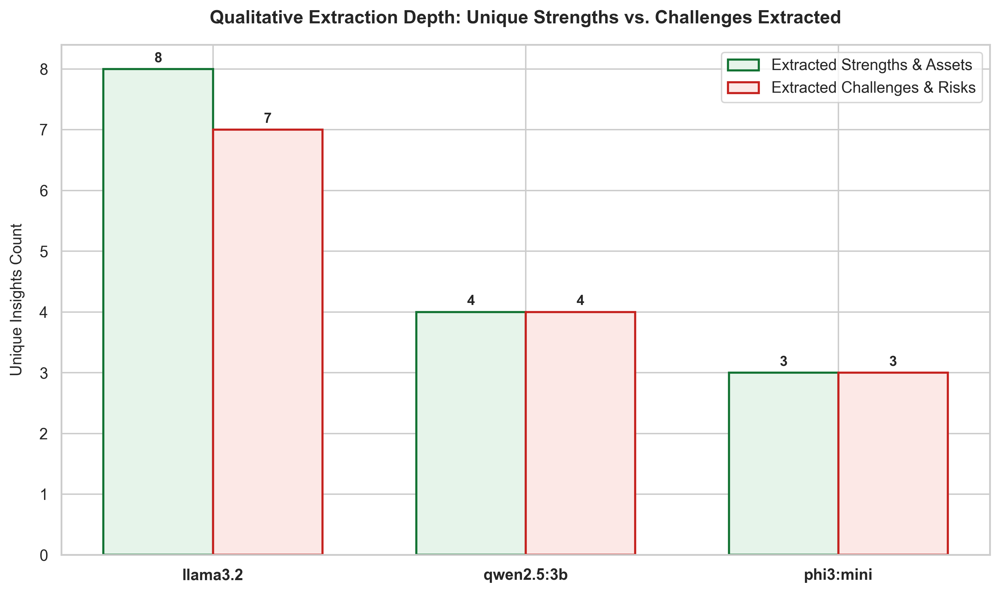

# Qualitative Depth: Finding Strengths and Navigating Challenges

Policy analysis is not just about mining numbers; it's about parsing complex qualitative narratives. A good model must extract the positive developments (strengths and assets) as well as the structural barriers (challenges and risks) mentioned in a report.

This chart compares the number of unique strengths and challenges extracted by our three models: **Llama 3.2, Qwen 2.5:3b, and Phi-3 Mini**.

## The Story in the Data

* **Llama 3.2 is the Depth Champion**: Despite its slow execution speed, Llama 3.2 excelled at qualitative analysis, extracting **8 strengths and 7 challenges**. It did not just skim the surface; it captured complex, nuanced concepts like "investing in regions of multiple deprivations" and "addressing poverty with an integrated approach." It showed a strong ability to synthesize paragraphs and extract multiple distinct ideas.
* **Qwen 2.5:3b is Balanced and Selective**: Qwen extracted **4 strengths and 4 challenges**. It chose to focus on high-level, clear points (e.g., basic education enrollment, labor market exclusion). This results in a cleaner, more readable summary, but misses some of the deeper context captured by Llama.
* **Phi-3 Mini is Surface-Level**: Phi-3 Mini extracted only **3 strengths and 3 challenges**, providing very brief, bullet-point answers. It captured the most obvious points but missed the broader picture.

## Key Takeaway

There is a clear trade-off between speed and qualitative depth. If your primary goal is to get a quick overview of a document, **Qwen 2.5:3b** provides a great balance. However, if you are conducting detailed research where capturing every qualitative nuance matters, **Llama 3.2** is the superior choice, despite its higher latency.
