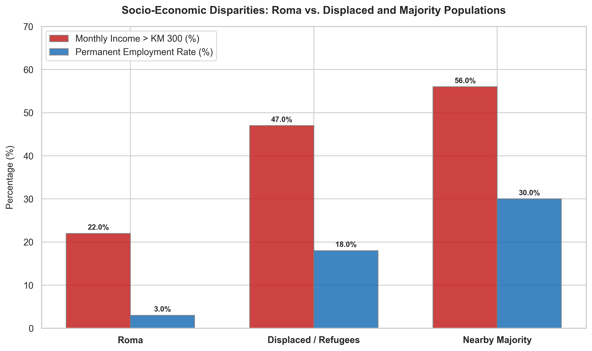

# The Cost of Discrimination: Economic Realities of the Roma Population in BiH

The Roma population represents one of the most structurally excluded groups in Bosnia and Herzegovina. The 2007 report conducted a targeted local survey comparing the Roma, displaced persons, and majority populations living in the same neighborhoods to isolate the economic impact of discrimination.

This chart compares monthly income levels and permanent employment rates across these three groups.

## The Story in the Data

* **The Income Chasm**: Only 22% of Roma had a monthly income above KM 300. This is less than half the rate of displaced persons (47%) and less than half of the nearby majority population (56%). Most Roma lived in extreme material deprivation, struggling to cover daily food and shelter costs.
* **The Permanent Employment Barrier**: A mere 3% of Roma held permanent jobs. This is 6 times lower than displaced persons (18%) and 10 times lower than the nearby majority (30%). With permanent jobs locked away, the Roma were almost entirely pushed into the informal grey economy (e.g., temporary day labor, collecting scrap metal), which offers no pension or social security benefits.
* **The Drivers of Exclusion**: The report explicitly attributes these numbers to structural discrimination and racism. Roma children often lacked birth certificates and identification documents, excluding them from school and formal work from birth. Furthermore, the survey found that employers were 2 to 3 times more likely to refuse a Roma applicant, and Roma reported experiencing racism in the workplace 5 to 10 times more frequently than other groups.

## Key Takeaway

The economic deprivation of the Roma in BiH was not a product of general economic conditions, but of systemic racism and institutional exclusion. Without targeted legal recognition, educational support, and anti-discrimination campaigns, general economic growth would continue to bypass this population entirely.
