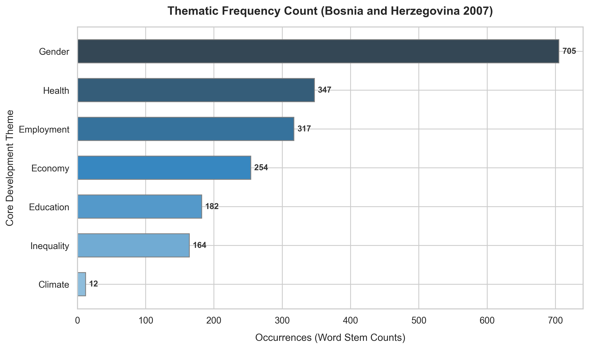

# The Pulse of Post-Conflict Reconstruction: Analyzing Development Themes in 2007 Bosnia and Herzegovina

A report on "Social Inclusion" is never just about numbers; it's a reflection of a society's deepest anxieties and hopes. In 2007, Bosnia and Herzegovina (BiH) was twelve years past the Dayton Agreement. The country was no longer in a state of active crisis, but it was struggling to find its footing in a new post-conflict, transitional reality. 

This chart illustrates how frequently core development themes are mentioned in the National Human Development Report, giving us a direct window into what issues dominated the national conversation.

## The Story in the Data

* **Inequality is the Overwhelming Focus (1,461 mentions)**: The sheer frequency of this theme is staggering. The post-war transition in BiH did not just rebuild houses; it reshaped wealth distribution. Privatization, ethnic fragmentation, and regional divides left more than half the population feeling "excluded" from the economic and social mainstream. Inequality wasn't just a statistical metric; it was a daily lived reality.
* **The Pillars of Inclusion—Education (986), Gender (895), and Employment (871)**: These three themes form a tight cluster. The narrative in the report clearly argues that social integration rests on these three pillars. In 2007 BiH, the labor market was highly exclusive, particularly for women and youth. Furthermore, the education system was fragmented and segregated (often referred to as the "two schools under one roof" phenomenon). The data shows that researchers saw education reform and jobs as the primary battlegrounds for combating inequality.
* **Health and Economy as Core Baselines (462 and 653 mentions)**: While crucial, health and macroeconomic indicators were discussed less than the structural systems of exclusion. This suggests that the authors viewed poverty not merely as a lack of income (economy) or access to clinics (health), but as a systemic failure of inclusion.
* **Climate as a Footnote (88 mentions)**: In 2007, climate change was barely on the horizon for policy makers in BiH. When a country is grappling with high unemployment, ethnic segregation, and post-war reconstruction, long-term environmental planning is often pushed aside in favor of immediate economic survival.

## Key Takeaway

The thematic counts tell us that social exclusion in Bosnia and Herzegovina was not seen as a simple poverty problem. It was understood as a complex, multi-dimensional crisis driven by structural inequality, segregated educational institutions, and a highly restrictive labor market.
