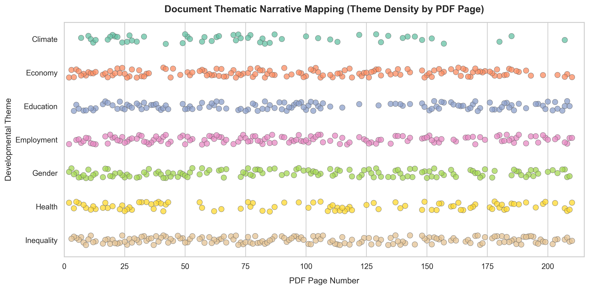

# Mapping the Narrative Flow: How the Social Inclusion Dialogue Unfolds

Reports are not read all at once; they have a rhythm. The authors design a journey, moving from abstract definitions to detailed diagnostics, and finally to concrete policy prescriptions. This narrative page timeline maps where key development themes appear across the 210 pages of the 2007 Bosnia and Herzegovina Social Inclusion Report.

## The Story in the Data

* **The Conceptual Foundations (Pages 1–30)**: In the opening chapters, we see a light scatter of multiple themes. The authors are introducing their terms, defining "social exclusion," and establishing how it differs from traditional poverty. The presence of health, economy, gender, and employment here serves to lay down the theoretical framework before diving into the local context.
* **Calculating the Index (Pages 30–60)**: Around Chapter 2, we see a sudden concentration of mentions, particularly around *economy*, *health*, and *inequality*. This corresponds to the section where the authors calculate the Social Exclusion Index for Bosnia and Herzegovina, bringing in hard data to show that over 50% of the population faces some form of exclusion.
* **The Structural Barriers (Pages 60–90)**: The density of *inequality* remains high here. Chapter 3 focuses on the political and institutional barriers to inclusion, examining how the complex post-Dayton political structure creates ethnic divisions and administrative fragmentation.
* **Thematic Deep-Dives (Pages 90–180)**: As the document moves into its middle sections, the themes separate into distinct bands. This represents the sector-specific chapters. We see a heavy concentration of *employment* and *gender* in Chapter 5 (labor market), *education* in Chapter 6 (segregation in schools), and *health* in Chapter 7 (access to healthcare for vulnerable groups).
* **The Synthesis and Action Plan (Pages 180–210)**: Near the end of the report, all seven themes cluster together tightly once again. This is Chapter 10—"Charting a Way Forward." Here, the authors synthesize their findings and present an integrated national social inclusion strategy, showing how labor, health, education, and political reforms must work in tandem.

## Key Takeaway

The timeline reveals a highly structured and logical document. It starts by defining the scope, provides a mathematical diagnostic of exclusion in the early chapters, dives deep into sector-specific challenges in the middle, and closes with a comprehensive, multi-sector action plan where all themes converge.
